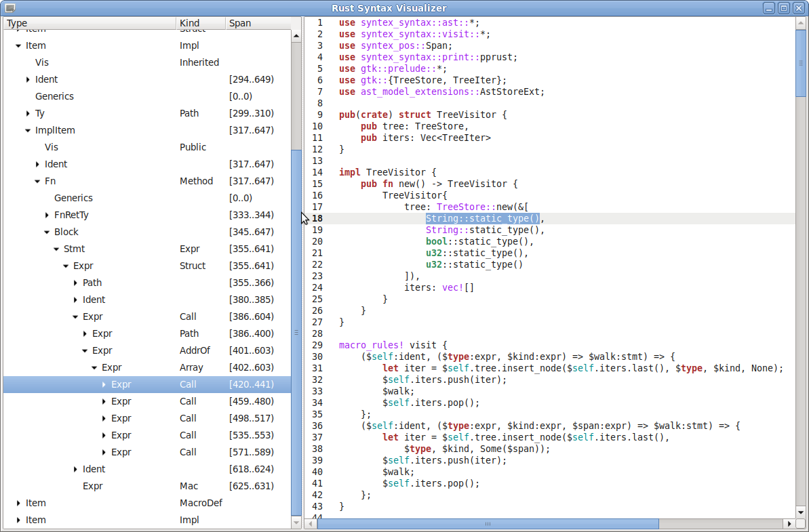

# Rust Syntax Visualizer

A GUI tool that allows to explore the AST of a rust source file.

Status: proof of concept.

Uses `GTK+-3` and `GtkSourceView-3` for GUI and `syntax_syntex` for rust parsing.

Inspired by [Roslyn Syntax Visualizer](https://github.com/dotnet/roslyn/wiki/Syntax-Visualizer).



## Prerequisites

### `GTK+-3`

Follow [this instruction](http://gtk-rs.org/docs-src/requirements.html) to install.

### `GtkSourceView-3`

Debian and Ubuntu:
```
sudo apt-get install libgtksourceview-3.0-dev
```

Fedora:
```
sudo yum install gtksourceview3-devel
```

Windows x86:
```
pacman -S mingw-w64-i686-gtksourceview3
```

Windows x64:
```
pacman -S mingw-w64-x86_64-gtksourceview3
```

## Build

`cargo build --release`
